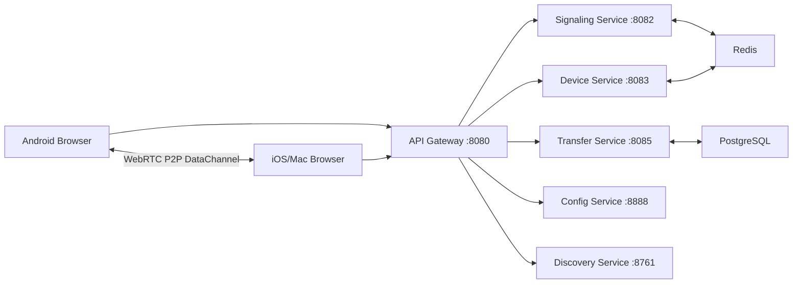

# Transy Backend System Design

## 1. Objective
Build a backend for cross-platform file transfer (Android/iOS/Mac/Web) where:
- signaling/control traffic goes through backend microservices
- file bytes transfer peer-to-peer via WebRTC DataChannel

## 2. High-Level Architecture

## 3. Services and Responsibilities
- `api-gateway`: entrypoint and routing metadata.
- `signaling-service`: WebRTC offer/answer/ICE signaling relay.
- `device-service`: device registration/list/heartbeat/session mapping.
- `transfer-service`: transfer metadata and status lifecycle.
- `config-server`: runtime config over websocket.
- `discovery-server`: service discovery registry + heartbeat.
- `common-lib`: shared DTOs/constants/logging framework.

## 4. Core Transfer Sequence
1. Devices connect to websocket endpoints.
2. Sender chooses target device from `device-service` list.
3. `signaling-service` exchanges offer/answer/ICE.
4. Browser peers establish WebRTC DataChannel.
5. File chunks flow directly peer-to-peer.
6. Progress/status events go to `transfer-service`.

## 5. Data Stores
- Redis:
  - active session ownership
  - cross-instance signaling relay support
- PostgreSQL:
  - transfer session metadata
  - audit/progress state

## 6. Observability
- Spring Actuator health endpoints per service.
- Prometheus profile available in production compose.
- Custom logging framework in `common-lib` (see `logging-framework.md`).

## 7. Ports
- `8080` api-gateway
- `8082` signaling-service
- `8083` device-service
- `8085` transfer-service
- `8888` config-server
- `8761` discovery-server

## 8. Scaling Model
- stateless horizontal service scale
- Redis used for shared routing context
- metadata persistence in PostgreSQL
- no file bytes through backend (major bandwidth savings)
